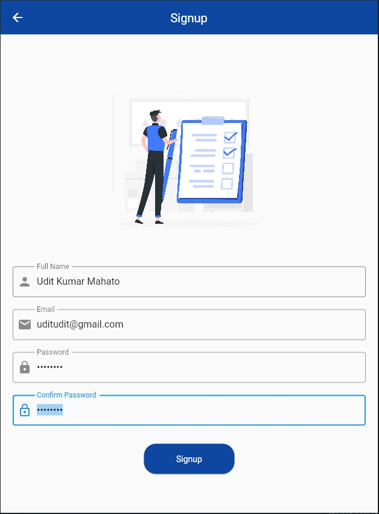
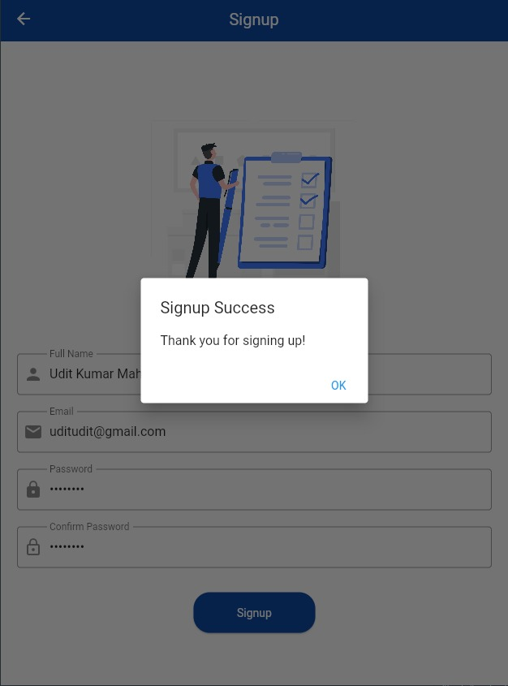
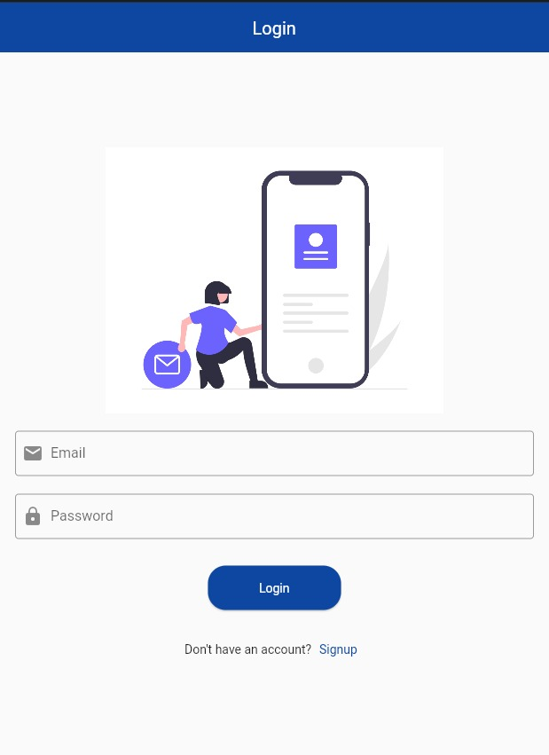
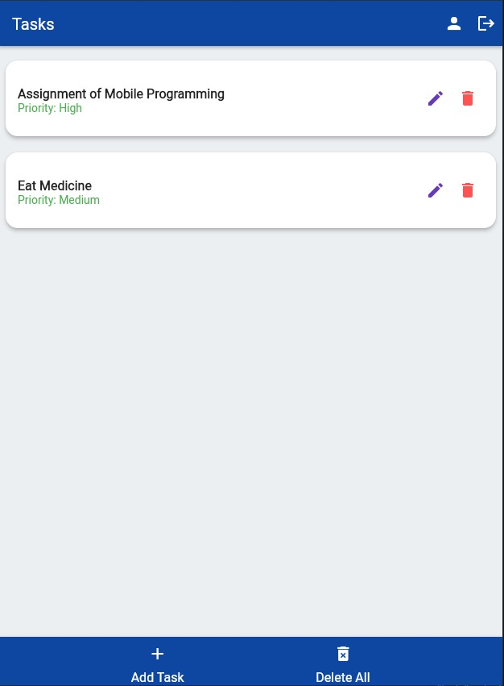
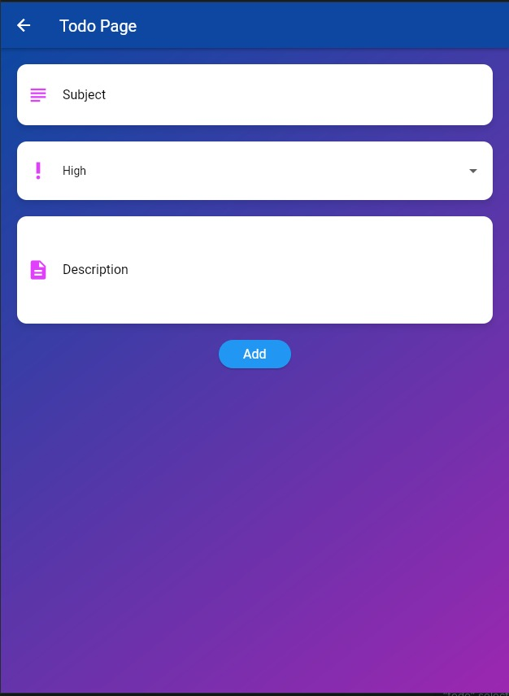
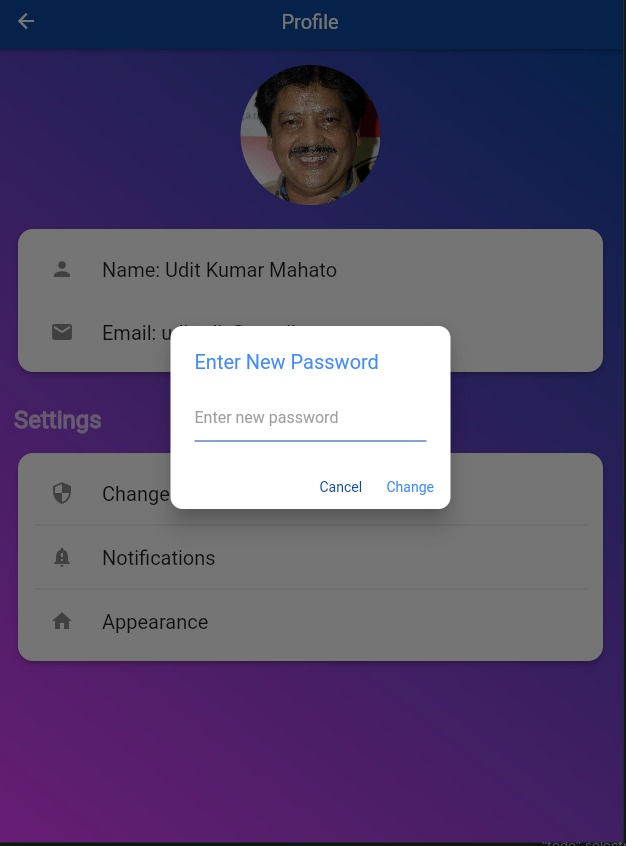
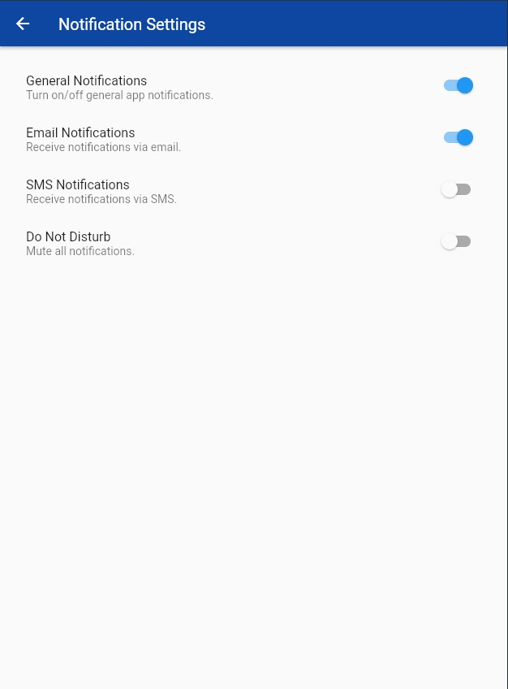
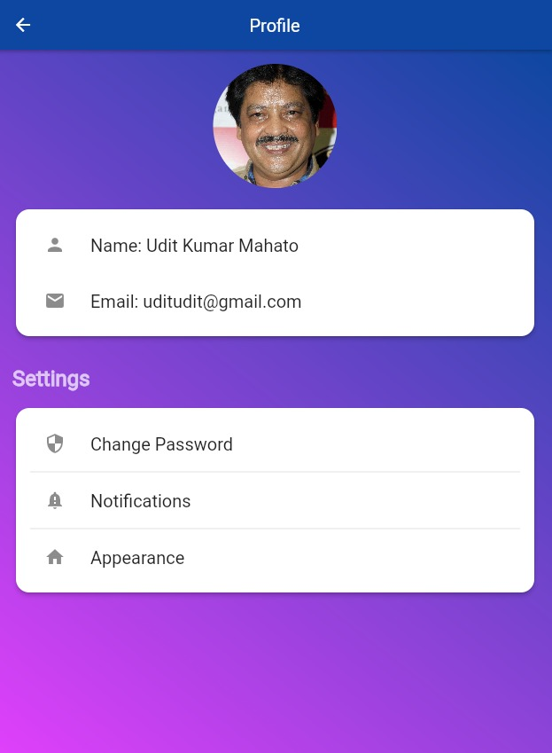
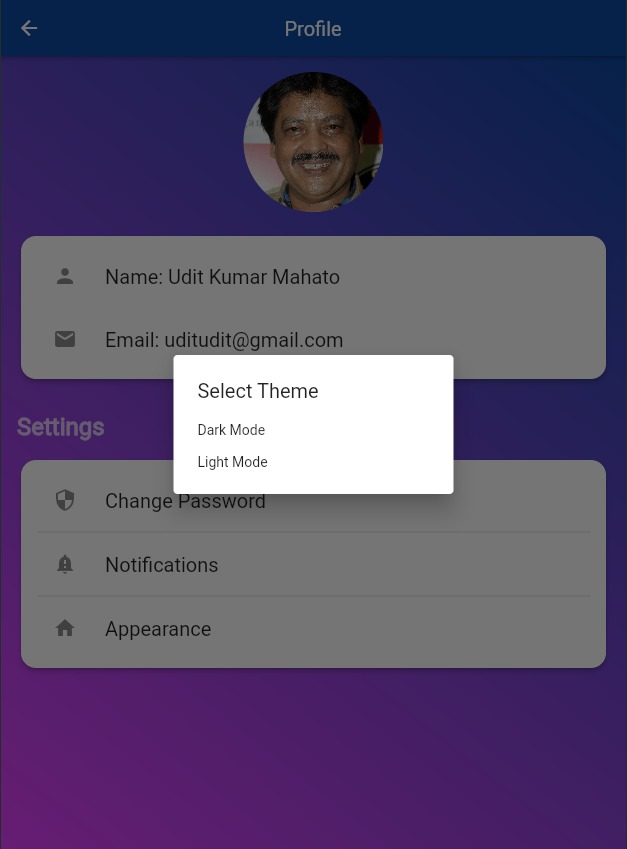

# Flutter To-Do Application with Firebase Authentication


This Flutter to-do application with Firebase authentication offers a range of features to help you manage your tasks efficiently.

## Features

- **Sign-up and Sign-in with Firebase:** Users can securely register and log in with their email and password.

- **CRUD Operations:** Create, read, update, and delete tasks to stay organized.

- **Task Priority:** Set priority levels for tasks to manage your time effectively.

- **Delete All Button:** Quickly clear your task list when needed.

- **User Profile:** View and manage your profile, including your name and email.

- **Change Profile Image:** Customize your profile with a profile image of your choice.

- **Change Password:** Update your password for enhanced security.

- **Theme Mode:** Choose from light and dark themes for a personalized experience.

- **Notifications:** Set task priorities and receive mobile notifications to stay on top of your to-dos.

## Screenshots











## Getting Started

To run this Flutter application, follow these steps:

1. **Clone the Repository:**

    ```bash
    git clone https://github.com/uditmahato/flutter_todo.git
    cd flutter_todo
    ```

2. **Firebase Configuration:**

    - Create a new Firebase project on the [Firebase Console](https://console.firebase.google.com/).
    - Configure Firebase for your app and download the `google-services.json` file.
    - Place the `google-services.json` in the `android/app` directory.
    - Add the necessary Firebase SDK dependencies to your `android/app/build.gradle` and `android/build.gradle` files.

3. **Flutter Dependencies:**

    Run the following command to install Flutter dependencies:

    ```bash
    flutter pub get
    ```

4. **Run the App:**

    Use the following command to run the app on an emulator or connected device:

    ```bash
    flutter run
    ```

## Configuration

You will need to configure the Firebase project with your own settings. Make sure to update the Firebase configuration files and adjust the app's Firebase settings as needed.

## Contributing

Contributions are welcome! If you'd like to improve this project, please open an issue or submit a pull request with your changes.

## License

This project is licensed under the MIT License - see the [LICENSE](LICENSE) file for details.

## Show Your Support

If you find this project useful, please consider giving it a star on GitHub to show your support.

[](https://github.com/uditmahato/flutter_todo)

Your support is greatly appreciated!

## Acknowledgments

- Thanks to the Flutter and Firebase communities for their valuable resources and documentation.
